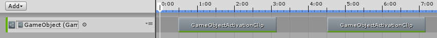
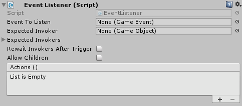
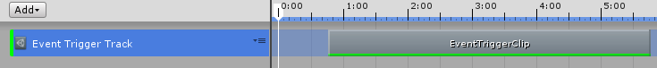
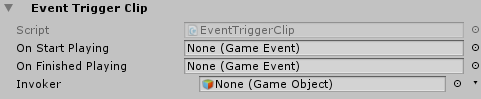

Some tools for Unity, using ScriptableObject :

- Editor Variables
- Events
- Sets

Totally based on this awesome talk : https://www.youtube.com/watch?v=raQ3iHhE_Kk

## Editor Variables

Allows designers to create variables in the editor. Those variables are stored as `.asset` files and can be referenced in any components and scenes.

### Usage

To create a variable : `Create Menu > Variables`

Available types : `Bool`, `Float`, `Int`, `String`, `Color`, `GameObject`, `Vector3`.

**In code**

	// Namespace
	using Game.Tools.Variables;
	
	public BoolVariable _aBool;
	// Or
	public BoolRef _anotherBool;
	
	// You can replace Bool with any other available type. Ex: FloatVariable, IntRef, etc.
	
	// Get or Set the value
	bool rawBool = _anotherBool.Value;
	_aBool.Value = false;

With `[Type]Variable`, you reference the asset only. But with `[Type]Ref` you can either reference the asset file or directly set a value of the given type. In the inspector, you will be able to choose between `Variable Object` or `Direct` : click on the button on the right of the field.

### Timeline

You can add a `GameObject Activation Track` in a Timeline. It allows to active a GameObject stored in a GameObjectVariable. When a `GameObject Activation Clip` is played, it will active the GameObject. When no clip is playing, the GameObject is disable.

## Events

Events as `.asset` files. To create an event, in the Project Window : `Create > Event`.

**In code**

	// Namespace
	using Game.Tools.Events;
	
	public GameEvent eventToTrigger;
	
	// Trigger the event
	eventToTrigger.Trigger();
	
	// Specify the invoker
	eventToTrigger.Trigger(gameObject);
	
	// Get the current event
	GameEvent.CurrentEvent;
	
	// Get the invoker
	eventToTrigger.Invoker;
	
	// Listeners : must return void and don't have args
	eventToTrigger.AddListener(EventAction listener);
	eventToTrigger.RemoveListener(EventAction listener);

### Event Listener component

- **Event To Listen** : which event we are expecting
- **Expected Invoker(s)** : specify which GameObject(s) must have triggered the event. Can be null. If there is more than one invoker, the Actions will be executed only once all invokers have triggered the event.
- **Rewait Invokers After Trigger** : if true, allows to executed the Actions more than once if the invokers trigger the event again.
- **Allow Children** : children of the expected invokers work too.
- **Actions** : what to do when the event is triggered.

### Timeline

You can add an `Event Trigger Track` in a Timeline. Each `Event Trigger Clip` will trigger the specified events when the clip starts or ends.

## Sets

Allows to store and access objects (like an array). Usefull to share objects between scenes.

To create a Set : `Create > Sets`

Available set types : `GameObject`, `Vector3`

**In code**

	// Namespace
	using Game.Tools.Sets;
	
	public GameObjectSet goSet;
	public Vector3Set vec3Set;
	
	// API
	set.Add(T toAdd);
	set.SetAt(T toSet, int index);
	set.GetAt(int index);
	set.Remove(T toDelete);
	
	// Works with foreach
	foreach(GameObject go in goSet) {
		// Do stuff ...
	}

